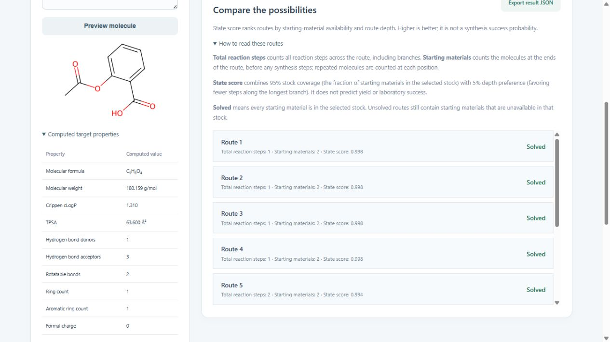
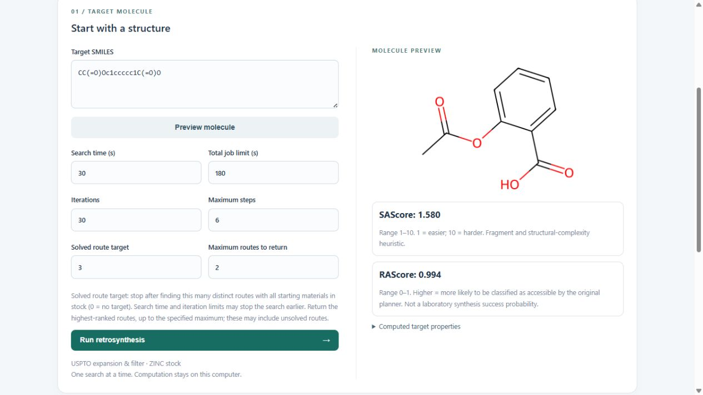
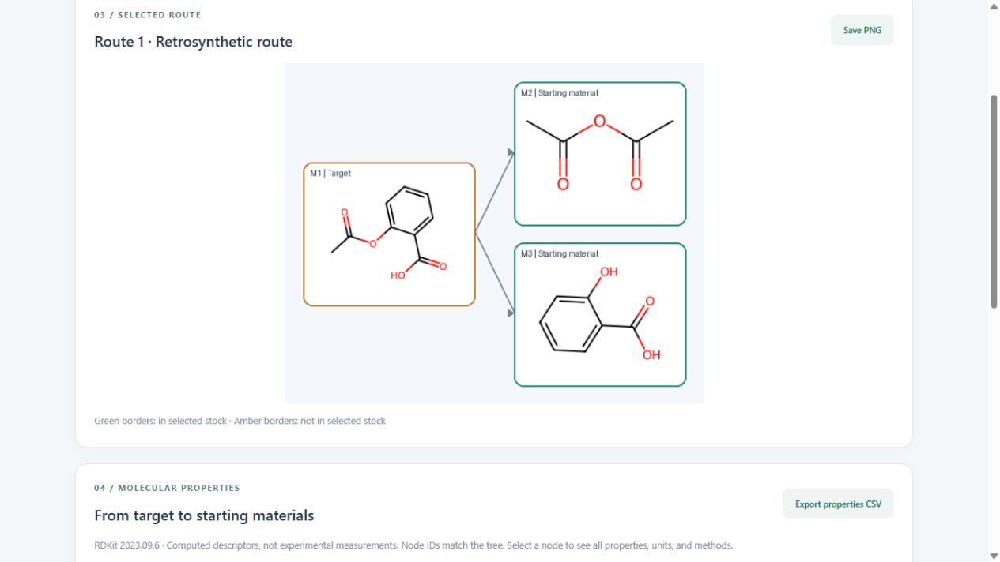
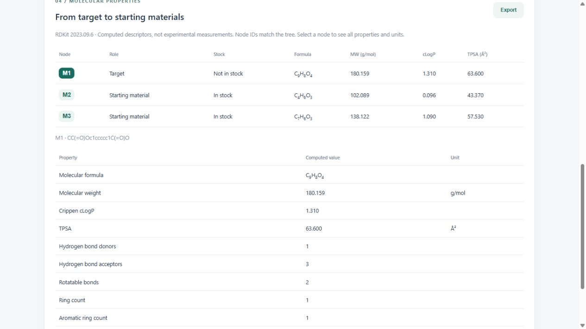
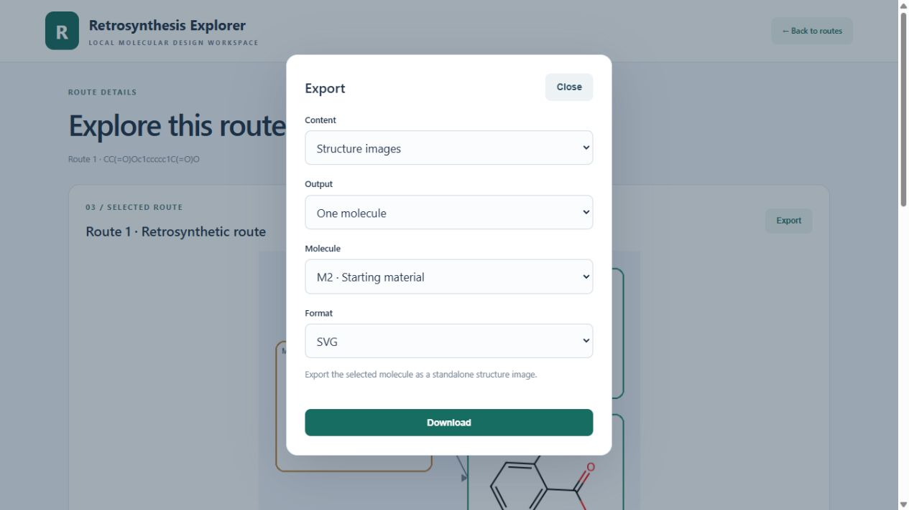

# Retrosynthesis Explorer


A local browser GUI for retrosynthetic route exploration with AiZynthFinder.
Enter a SMILES string, preview the target, run a search, compare the returned
routes, then select a route to inspect its molecular tree and computed properties.

The app serves an English interface at **http://127.0.0.1:8765**. Search runs in
a separate process so the server can report status, enforce a total deadline and
cancel work. Molecular input and search results stay on your computer.

> Initial local release. Windows x64 has been exercised in the development
> environment; macOS Apple Silicon and Intel are installation targets awaiting
> native testing. A predicted route is not experimental validation. GitHub Pages
> deployment is outside the current scope.



## Setup

### 1. Install Conda and clone the project

Install Miniforge or Miniconda for your native architecture. On Windows, open a
Conda-enabled terminal. On macOS, use the native architecture rather than mixing
an Intel Conda environment with Apple Silicon packages.

```bash
git clone https://github.com/jjjabcd/Retrosynthesis_Explorer.git
cd Retrosynthesis_Explorer
```

Keep the `aizynfinder` subdirectory: its spelling is intentional and its internal
Python package is still named `aizynthfinder`. It is preserved source code, not a
second Git repository. Do not independently rename the Python package.

### 2. Run the installer

**Windows**

```bat
setup.bat
```

**macOS — native validation pending**

```bash
chmod +x setup.sh run.sh run.command
./setup.sh
```

The scripts find Conda, create `.conda-env` with Python 3.11, install the local
AiZynthFinder source and GUI dependencies, download the public data, check
checksums and load the models/stock as a diagnostic. The project path may contain
spaces or Korean characters. AiZynthFinder is installed as a regular package to
avoid the Python 3.11/Poetry editable `.pth` encoding failure on Windows.

The default public assets total approximately **775 MB**, in addition to the
environment. Allow extra disk space and memory for the stock and dependencies.
The installer reuses files whose size and checksum match and retries failed
downloads. It writes new data to temporary files before replacing complete files.
Review [model and data attribution](docs/MODEL_DATA_SOURCES.md): model/template
CC BY 4.0 and deposited stock MIT are separate from the app's code license.

Core versions are pinned in [`constraints.txt`](constraints.txt). ONNX Runtime
1.23.2 has Python 3.11 wheels for Windows x64 and both Mac architectures; its Mac
wheels target macOS 13+. This is a package availability check, not proof of a
working macOS installation. See [verification status](docs/VERIFICATION.md).

### 3. Launch the workspace

**Windows**

```bat
run.bat
```

**macOS**

```bash
./run.sh
# Or double-click run.command after granting executable permission.
```

The browser opens after the server is ready. Keep the terminal open; press
**Ctrl+C** there to stop the server and cancel any active search. Starting the
same project again reopens its running server.

To choose another port or keep the browser closed:

```bat
run.bat -Port 8766 -NoBrowser
```

```bash
./run.sh --port 8766 --no-browser
```

The default bind address is `127.0.0.1`. Run one server instance per project and
one Uvicorn worker. This is a single-user local app, not a shared public service.

## Tutorial — Explore aspirin

### Step 1 — Enter and preview the target

Enter this SMILES in **Target SMILES**, then click **Preview molecule**:

```text
CC(=O)Oc1ccccc1C(=O)O
```

The structure appears below the input. Expand **Computed target properties** to
view descriptors. Formula atom counts use subscripts. Count and dimensionless
values are shown without unit labels; g/mol and Ų remain visible.
Invalid or empty SMILES produces an English error; changing
the input clears the old preview until you preview it again.

The preview also displays **SAScore** (1–10, lower is easier) and **RAScore**
(0–1, higher is classified as more accessible). Both are computed estimates.
RAScore is the ChEMBL XGBoost model, not a laboratory success probability.
See [methods, versions and validation limitations](docs/ACCESSIBILITY_SCORES.md).



### Step 2 — Set limits and run the search

Choose the search time, total job limit, iteration limit and maximum steps.
**Solved route target** stops at the requested number of distinct solved routes
(0 disables this early stop). **Maximum routes to return** caps the ranked list.
Time or iteration limits may stop the search before the target is reached; returned
routes may include unsolved routes. Counts and the stop reason appear above the list.
Click **Run retrosynthesis**. The status progresses through model loading,
searching and route ranking, with elapsed time displayed. **Cancel search** stops
the worker. Another search is rejected while one is running.

The search time excludes model loading. The separate total limit includes the
entire worker lifetime; use a larger total limit on slower machines. Cancellation
or the hard timeout does not provide partial results.

### Step 3 — Compare the route list

The route list appears first, before images are generated. Each entry shows its
total reaction steps, starting-material count, state score and solved status.
Open **How to read these routes** for definitions. State score combines 95%
stock coverage and 5% depth preference, favoring shorter longest branches.

**Solved** means every terminal molecule is available in the selected ZINC stock
snapshot. It does not mean current supplier availability or a proven synthesis.
**Scores are ranking heuristics, not synthesis success probabilities.** Results
and route counts can vary with the search budget and software/data versions.

The target is excluded from stock checks during search so that the planner explores precursors even if the target itself exists in the raw stock.

### Step 4 — Select a route and inspect its tree

Click a route to open its **separate detail page**, containing the tree and
molecular properties (blocks 03 and 04). **Back to routes** returns to the same
search results; reloading the detail page also preserves the selected route.
The PNG tree is generated on selection and cached. Product-to-precursor arrows
show the retrosynthetic direction. Node IDs such as **M1**, **M2** and **M3** match
the property table. Green borders indicate stock membership; amber borders
indicate molecules absent from the selected stock.
The **Retrosynthetic route** image fits the panel. Use **Export** to choose a whole-route image or molecule images.
Stock membership uses border colors rather than repeated text inside each node.



### Step 5 — Inspect each molecule



The property table includes the target, intermediates and terminal starting
materials. Click a node ID to see all descriptors and units:

| Property | Unit / interpretation |
|---|---|
| Molecular formula | Formula calculated from the supplied structure |
| Molecular weight | g/mol; average atomic weights |
| Crippen cLogP | Calculated log10 of the octanol/water partition coefficient; dimensionless |
| TPSA | Ų; RDKit default N/O contributions |
| Hydrogen bond donors / acceptors | Counts |
| Rotatable bonds | Count; RDKit default strict definition |
| Ring count / aromatic ring count | Counts |
| Formal charge | Elementary charge units, e |

All are **computed descriptors, not experimental measurements**. The exact RDKit
version and method accompany the values. The same canonical molecule reuses its
descriptors, but repeated occurrences keep distinct node IDs. Salt stripping,
neutralization and tautomer normalization are not applied automatically.
pKa, solubility, melting point and boiling point require other models or data and
are not included.

### Step 6 — Save and revisit results

Use **Export result JSON**, **Save PNG** and **Export properties CSV**. Results
also remain under `results/<job-id>/`: job status, complete route JSON, selected
route details, generated PNGs and exported property CSVs. JSON records input,
limits, software versions, selected stock and the asset provenance manifest.

Use **Recent jobs** to reopen finished searches after restarting the app. A job
left running by an unexpected server stop is marked **Interrupted** on startup.
The app does not automatically delete saved jobs or send molecular input to
external services.

## Troubleshooting

| Message / situation | Action |
|---|---|
| Conda was not found | Start from a Conda terminal or set `CONDA_EXE` to your Conda executable. |
| Environment has the wrong Python version | Create a Python 3.11 environment for this project; do not reuse an unrelated environment. |
| Download failed or checksum mismatch | Retry setup. Completed verified files are reused; inspect network/proxy availability. |
| Download lock remains after a crash | Make sure no setup process is running, remove only `data/.download.lock`, then retry. |
| Models and stock are not configured | Run setup to completion. The GUI can preview molecules before model setup. |
| Total job time limit reached | Increase the total limit to cover model loading and searching. |
| Port is occupied | Choose another port with the flags above. |
| Project folder moved | Rerun setup to refresh installation paths and `data/config.yml`; Conda environments may need recreation after a move. |
| No solved route | A longer search may help; the stock/model may not cover the target. An unsolved result is still a valid search outcome. |
| Image limit exceeded | Export JSON; the renderer caps routes at 200 nodes and 30 megapixels. |

Detailed search failures are retained as `results/<job-id>/error.log` when the
worker catches an exception. Forced worker exits are reported by exit code.

## Development and verification

From the project root in its Conda environment:

```bash
conda activate ./.conda-env
python -m pip install -c constraints.txt './aizynfinder' -e '.[test]'
python -m pytest -q
python -m explorer.diagnose
python -m explorer.launcher --no-browser
# From a second terminal, with the same environment:
python scripts/verify_live.py
```

On Windows the activation command can also be written as
`conda activate .\.conda-env`. Test fixtures exercise lifecycle,
security, molecule occurrence IDs, integrity checks and exports; the live script
separately runs actual model inference. These app tests are separate from the
preserved upstream test suite.

See [architecture and Git migration](docs/ARCHITECTURE.md) and
[verified results and limitations](docs/VERIFICATION.md).

## License and acknowledgments

New Explorer code: [MIT](LICENSE), copyright Jin Hyuk Kim.
AiZynthFinder source: its [original MIT license](aizynfinder/LICENSE), copyright
Samuel Genheden and Esben Bjerrum, preserved in full.
See [third-party notices](THIRD_PARTY_NOTICES.md) and
[model/data sources and terms](docs/MODEL_DATA_SOURCES.md).

Built on the work of the MolecularAI AiZynthFinder contributors and RDKit
contributors. The AMD README informed the tutorial-oriented documentation style.

Setup now also requires Git to clone the pinned RAscore source into `external/RAscore`.
This deliberately separate checkout and its models are ignored by the parent repository.

### Export images and properties

The home page uses a narrower, centered layout: target input and preview first,
route list below, then workspace status and recent jobs.

In route details, each **Export** button opens the same format-and-output chooser:

| Content | Output | Format |
|---|---|---|
| Structure images | Entire retrosynthetic route | PNG |
| Structure images | One molecule, selected by node ID | PNG or SVG |
| Structure images | All molecules, one file per node | ZIP containing PNG or SVG files and a manifest |
| Molecular properties | All route molecules or one selected node | CSV or JSON |



Images use the node IDs shown in the route. Repeated molecules retain separate
files for their occurrences. CSV omits calculation-method columns; JSON retains
method/version provenance. The on-screen property table shows property, value
and unit without the calculation-method column. Existing CSV API links still work.
